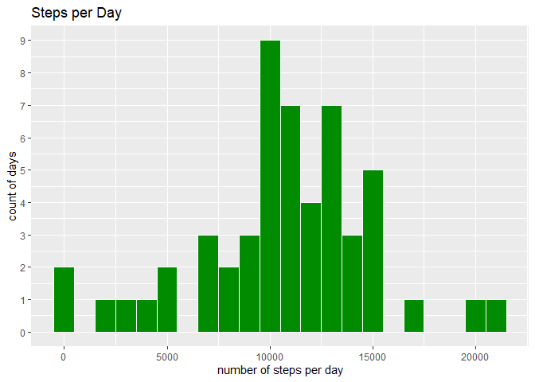
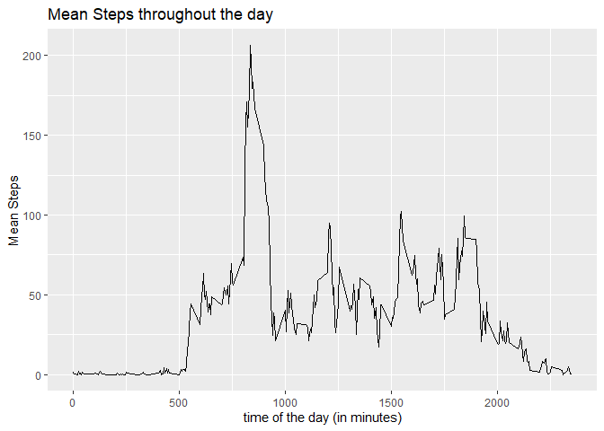
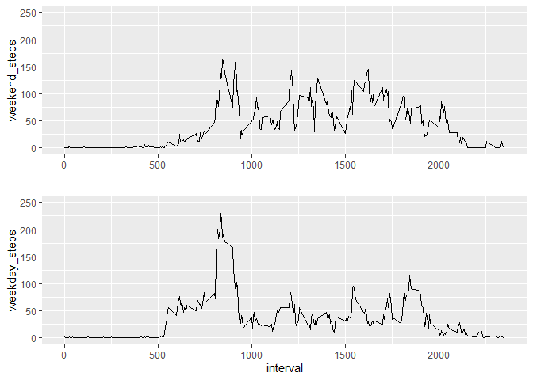

## Introduction

This R Markdown document serves to complete the Reproducible Research - Week 2 assignment from Coursera's JHU Data Science Specialization. This document will be broken into the following sections based on the assignment:

1. Loading and basic preprocessing the data
2. Determining the mean total number of steps taken per day
3. Determining the average daily activity pattern
4. Imputing missing values
5. Determining if there are differences in activity patterns between weekdays and weekends

***

<br>

### 1. Loading and preprocessing the data

Here we will read the data in and perform basic preprocessing that will be needed for later analysis.


```r
# Unzip the activity.zip file
zipF<- "activity.zip"
outDir<-"./data"
unzip(zipF,exdir=outDir)
```
<br>
Now our untouched data is in /data/activity.csv. We will load it into R for preprocessing.  

```r
# Load in the activity into the variable activity_given
activity_given <- read.csv("./data/activity.csv")

# data where na observations are removed
activity_na_rm <- subset(activity_given, !is.na(activity_given$steps))
```

***

<br>

### 2. Determining the mean total number of steps taken per day

First, we will calculate the total number of steps taken per day:

```r
# Load in the activity into the variable activity_given
steps_per_day <- aggregate(activity_given[,1], by = list(activity_given$date), FUN = sum)
names(steps_per_day) <- c("date", "steps_given")

head(steps_per_day, 3)
```

```
##         date steps_given
## 1 2012-10-01          NA
## 2 2012-10-02         126
## 3 2012-10-03       11352
```

<br>


```r
# Here we make a histogram of the number of steps taken each day
library(ggplot2)
ggplot(data = subset(steps_per_day, !is.na(steps_given)), aes(x=steps_given)) + 
        geom_histogram(binwidth = 1000, color="white", fill="green4") +
        ggtitle("Steps per Day") + xlab("number of steps per day") + ylab("count of days") +
        scale_y_continuous(breaks = seq(0, 9, by = 1), labels = seq(0, 9, by = 1))
```

<!-- -->

<br>

Now we will calculate the mean and median of the total number of steps taken per day.

```r
steps_daily_mean <- mean(steps_per_day$steps_given, na.rm = TRUE)
steps_daily_median <- median(steps_per_day$steps_given, na.rm = TRUE)
```

The calculated **mean** of the total number of steps taken each day is **10766.1886792**.  
The calculated **median** of the total number of steps taken each day is **10765**.

***

<br>

## 3. Determining the average daily activity pattern


```r
steps_interval_mean <- aggregate(x = activity_na_rm$steps,
                                 by = list(activity_na_rm$interval), FUN = mean)
names(steps_interval_mean) <- c("interval", "steps_mean")
```


```r
ggplot(steps_interval_mean, aes(interval, steps_mean)) + geom_line() +
        ggtitle("Mean Steps throughout the day") + xlab("time of the day (in minutes)") + ylab("Mean Steps")
```

<!-- -->


```r
max_avg_interval <- steps_interval_mean$interval[which.max(steps_interval_mean$steps_mean)]
```

The 5 minute interval with the maximum number of steps on average is **835**.

***

<br>  

## 4. Imputing missing values

Calculate and report the total number of missing values in the dataset (i.e. the total number of rows with NAs).


```r
number_na <- sum(is.na(activity_given))
```

The number of NA values is **2304**.


### Strategy for filling in the NA values.

**Method:** There are several intervals with NA values in the given data. We will replace any NA values with the mean value for the corresponding interval based on the rest of the data. This is not a perfect strategy but will suffice for now.

<br>

Before modifying the data here are our first few rows:

```r
head(activity_given, 3)
```

```
##   steps       date interval
## 1    NA 2012-10-01        0
## 2    NA 2012-10-01        5
## 3    NA 2012-10-01       10
```

<br>

We can see that the first few days have NA values for their steps. Now we replace the NAs with the mean values as mentioned before and save it to the dataframe named **activity_na_replace**.

```r
activity_na_replace <- cbind(activity_given, steps_mean = steps_interval_mean$steps_mean)

for(i in 1:nrow(activity_na_replace)){
  if(is.na(activity_na_replace$steps[i])){
          activity_na_replace$steps[i] <- activity_na_replace$steps_mean[i]
  }
}

# Remove column of means
activity_na_replace$steps_mean <- NULL
```


```r
head(activity_na_replace, 3)
```

```
##       steps       date interval
## 1 1.7169811 2012-10-01        0
## 2 0.3396226 2012-10-01        5
## 3 0.1320755 2012-10-01       10
```
  
<br>

Next we will make a histogram of the steps taken each day:

```r
steps_per_day$steps_na_replace<-aggregate(activity_na_replace[,1], 
                                          by = list(activity_na_replace$date),
                                          FUN = sum)[,2]
```


```r
# Here we make a histogram of the number of steps taken each day
library(ggplot2)
ggplot(data = steps_per_day, aes(x=steps_na_replace)) + 
        geom_histogram(binwidth = 1000, color="white", fill="blueviolet") +
        ggtitle("Steps per Day (NAs replaced)") + xlab("number of steps per day") + 
        ylab("count of days") 
```

<!-- -->

<br>

Now we will calculate the mean and median of the total number of steps taken per day with this new dataset.

```r
steps_daily_mean_na <- mean(steps_per_day$steps_na_replace)
steps_daily_median_na <- median(steps_per_day$steps_na_replace)
```

The calculated **mean** of the total number of steps taken each day is **10766.1886792**.  
The calculated **median** of the total number of steps taken each day is **10766.1886792**.
  
<br><br>
  
**Do these values differ from the estimates from the first part of the assignment? What is the impact of imputing missing data on the estimates of the total daily number of steps?**

Yes, these values are different than before:

* We are replacing NAs with positive integers, so our new sums are higher than before.
* The daily mean has stayed the exact same which makes sense as the only values added were the mean itself.
* The median has slightly changed from **10765** to the value of the mean **10766.1886792**.

***

<br>

### 5. Determining if there are differences in activity patterns between weekdays and weekends

We will convert the date column from factors to dates

```r
activity_na_replace$date <- as.Date(activity_na_replace$date)
```

<br>

Now we will create a new factor variable in the dataset with two levels – “weekday” and “weekend” indicating whether a given date is a weekday or weekend day.

```r
weekends <- c("Saturday", "Sunday")

activity_na_replace$day <- factor((weekdays(activity_na_replace$date) %in% weekends),
                                  levels=c(TRUE, FALSE), labels=c('weekend', 'weekday'))

head(activity_na_replace, 3)
```

```
##       steps       date interval     day
## 1 1.7169811 2012-10-01        0 weekday
## 2 0.3396226 2012-10-01        5 weekday
## 3 0.1320755 2012-10-01       10 weekday
```


Now we will contruct a plot showing the average weekday steps per interval separately from the average weekend steps per interval:

```r
temp <- aggregate(x = activity_na_replace$steps,
                                 by = list(activity_na_replace$interval, activity_na_replace$day),
                                 FUN = mean)
steps_interval_mean["weekend_steps"] <- temp$x[1:288]
steps_interval_mean["weekday_steps"] <- temp$x[289:576]
```


```r
library(gridExtra)
p1 <- ggplot(steps_interval_mean, aes(interval, weekend_steps)) + geom_line() +
        ylim(0, 250) + xlab("")
p2 <- ggplot(steps_interval_mean, aes(interval, weekday_steps)) + geom_line() +
        ylim(0, 250)
grid.arrange(p1, p2, nrow = 2)
```

<!-- -->

